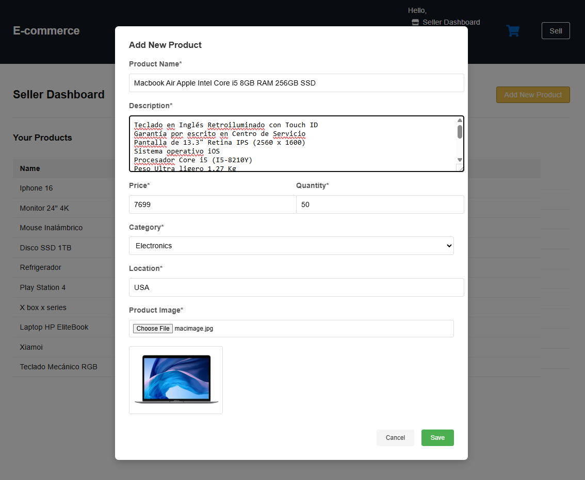
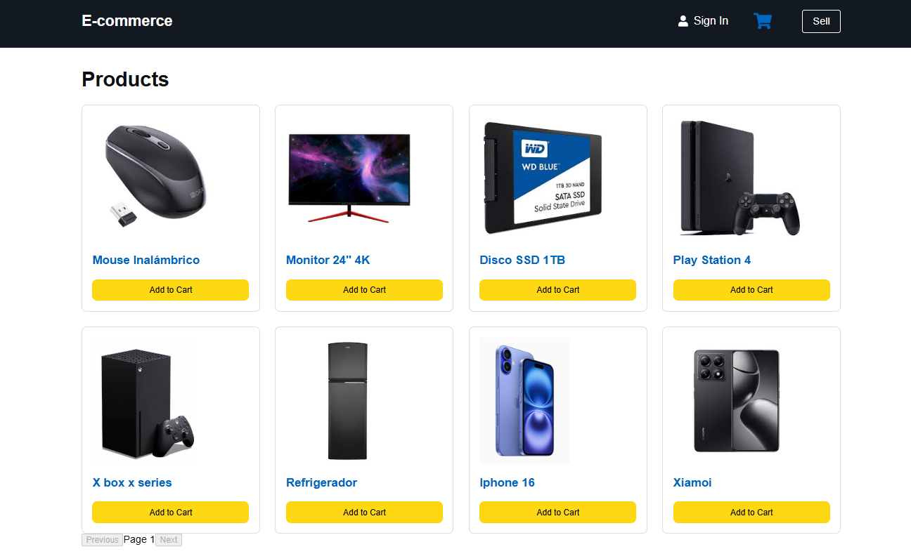
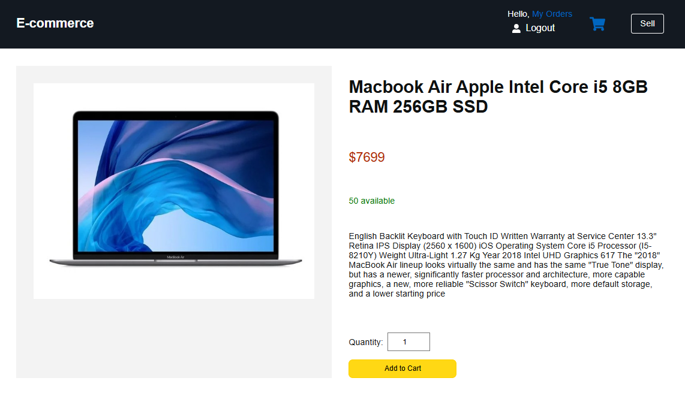
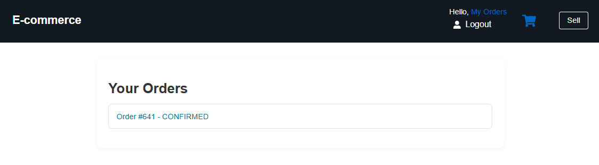
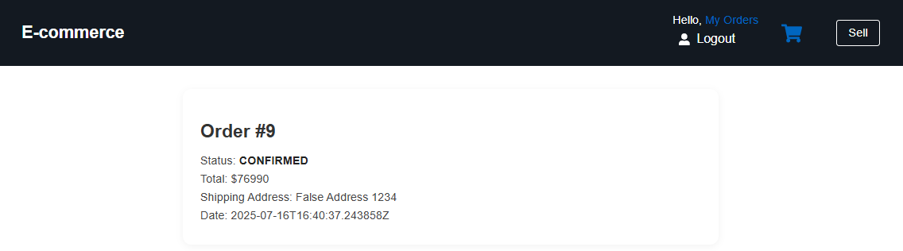
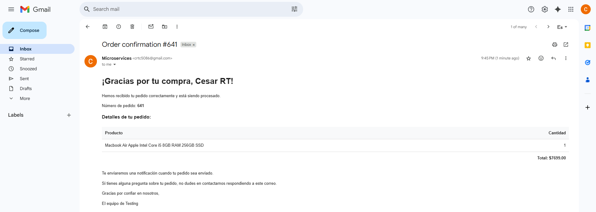
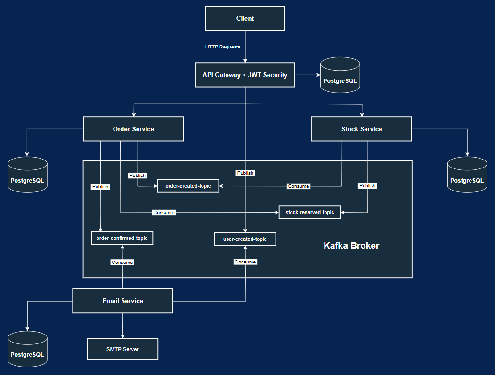
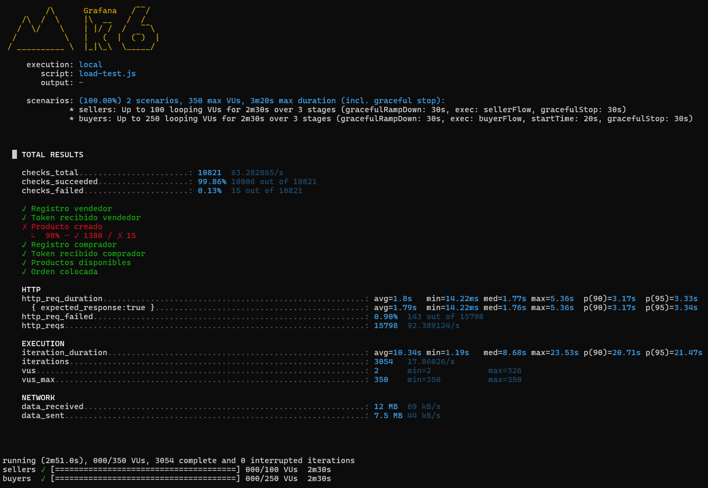

# 🛒 Scalable E-Commerce Backend – Microservices Architecture

Personal proof-of-concept to demonstrate experience with backend architecture, microservices, authentication, resilience, event-driven communication, and performance under load.

---

## 📌 Description

This system simulates a real-world e-commerce platform using microservices and event-driven architecture.

### 🧾 Key Features

- **Product publishing by sellers (Seller dashboard)**
  
  

- **Paginated product listing**

  

- **Detailed product view**

  

- **Order creation by buyers**

  

- **Order history (Buyer dashboard)**

  

- **Order detail view**

  

- **Event-driven email notifications**

  

- **Stock validation before order confirmation**
  
  The system validates availability before confirming orders. If sufficient stock is available, the order is marked as `CONFIRMED`; otherwise, it is `REJECTED`.

- **Centralized authentication with Spring Security + JWT**
  
  All authentication is managed through the API Gateway. Tokens include the user's UUID and role.

- **Role-based access control (SELLER, BUYER)**
  
  Sellers can create products. Buyers can place and view their orders.

- **Load tested under concurrent traffic using K6**
  
  Simulations reached over 3,000 users and 15,000 HTTP requests under local infrastructure, validating horizontal scalability and resilience.


## 🧱 Architecture Overview



## 🛠️ Tech Stack

- Java 17, Spring Boot
- Spring Security (JWT)
- Spring Cloud Gateway
- Spring Cloud Netflix Eureka
- Spring Cloud LoadBalancer
- Spring Data JPA (Order, Email)
- Spring WebFlux + R2DBC (Stock)
- PostgreSQL
- Apache Kafka (event-driven messaging)
- Docker + Docker Compose
- K6 (load testing)

## 🔐 Roles & Permissions

| Role   | Permissions                    |
| ------ | ------------------------------ |
| BUYER  | Browse products, create orders |
| SELLER | Publish products               |

## 📚 API Endpoints

> All endpoints are exposed through the API Gateway (`http://localhost:8080`).  
> Endpoints that require authentication expect a valid JWT in the `Authorization` header.

### 🔐 Auth (via Gateway)

- `POST /auth/register`  
   Register new user.

  📦 Body:
  {
    name: String,
    email: String,
    password: String,
    role: "SELLER" | "BUYER"
  }

- `POST /auth/login`  
   Authenticates and returns a JWT token.

  📦 Body:
  {
    email: String,
    password: String
  }

---

### 🧾 Order Service (via Gateway)

- `POST /api/orderService/placeOrder`  
   Create an order (BUYER role required).  
  📎 Requires JWT  
  📦 Body:
  {
    items: [
        { productCode: String, productName: String, qty: Integer }
        ],
    total: BigDecimal,
    shippingAddress: String
  }

- `GET /api/orderService/orders/`  
  Get all orders for the authenticated user  
  📎 Requires JWT  
  🔐 Extracts user ID from token

- `GET /orderService/{orderId}`  
  Get a specific order for the authenticated user  
  📎 Requires JWT
  📦 Body:
  {
    orderId: Long
  }

---

### 📦 Stock Service (via Gateway)

- `GET /stockService/?page={page}&size={size}`  
  Get paginated list of products  
  📄 Public endpoint (no auth)  
  🔢 Example: `?page=0&size=10`

- `GET /api/stockService/{productCode}`  
  Get detailed information for a specific product  
  📄 Public endpoint
  📦 Body:
  {
    productCode: String
  }

- `GET /api/stockService/image/{productCode}`  
  Retrieve image for a product  
  📄 Public endpoint
  📦 Body:
  {
    productCode: String
  }

- `GET /api/stockService/seller`  
  Get products created by the authenticated seller  
  📎 Requires JWT (SELLER role)

- `POST /api/stockService/seller/create`  
  Create a new product  
  📎 Requires JWT (SELLER role)  
  📦 Body:
  {
    productName: String,
    description: String,
    price: Double,
    qty: Integer,
    category: String,
    minimumStock: Integer,
    location: String,
    image: File
  }

## 📦 Shared Event Module – base_domains

A shared module containing immutable record classes used across all services for Kafka event payloads. This ensures schema consistency and avoids duplication.

## 📊 Load Testing Results – K6

To validate performance and scalability, two stress tests were conducted, simulating the real-world behavior of BUYERS and SELLERS using [K6](https://k6.io/).  

All traffic was routed through the API Gateway, triggering workflows for:
- User registration.
- Authentication.
- Product creation.
- Paginated product retrieval (for site display).
- Specific product lookup by ID (to view details).
- Order placement.
- User-specific order history retrieval.
- Retrieving specific orders by their ID to view their information.
- Specific order lookup by ID (to review information)

All at the same time to simulate real-life scenarios.

---

### 🧩 Test Scenarios

| Feature                       | Test 1                | Test 2                         |
|-------------------------------|-----------------------|--------------------------------|
| Service instances             | 1 per service         | 2x order & stock services      |
| Service discovery             | ❌ None              | ✅ Eureka Server               |
| Load balancing                | ❌ None              | ✅ Spring Cloud LoadBalancer   |
| Virtual users (max)           | 350                   | 350                            |
| Duration                      | 2m51s                 | 2m51s                          |

---

### 📌 Functional Results

| Metric                       | Test 1   | Test 2   | ✅ Outcome                       |
|------------------------------|----------|----------|----------------------------------|
| Total users registered       | 2641     | 3054     | +15.6%                           |
| SELLERS                      | 1211     | 1395     | ✅                               |
| BUYERS                       | 1430     | 1659     | ✅                               |
| Products created             | 1211     | 1395     | ✅                               |
| Orders placed                | 1430     | 1659     | ✅                               |
| Confirmed                    | 1295     | 1479     | ✅                               |
| Rejected (no stock)          | 135      | 180      | ✅ (proportional)                |
| Internal server errors       | 0        | 0        | ✅                               |

---

### ⚙️ Performance Metrics

| Indicator                    | Test 1   | Test 2   | ✅ Notes                      |
|------------------------------|----------|----------|--------------------------------|
| http_req_duration (avg)      | 2.13s    | 1.80s    | -15% latency                   |
| http_req_duration (p95)      | 4.09s    | 3.33s    | Better 95th percentile         |
| http_req_failed (%)          | 1.10%    | 0.90%    | Fewer network failures         |
| checks_failed                | 29       | 15       | More reliable                  |
| completed iterations         | 2641     | 3054     | +15.6% throughput              |
| total HTTP requests          | 13,643   | 15,798   | More requests handled          |
| data_received                | 10 MB    | 12 MB    | Consistent                     |
| data_sent                    | 6.5 MB   | 7.5 MB   | Consistent                     |

---

### ✅ Technical Conclusion

- System scaled well under increased load.
- Data integrity was maintained (confirmed/rejected orders handled properly).
- Average response times and error rates improved significantly.
- Eureka and LoadBalancer helped improve distribution and resilience.
- Even under local setup (non-cloud), the system supported 3,000 + users and 15,000 + requests.

> ⚠️ IMPORTANT NOTE

I performed these tests in my own local environment, which is obviously limited—lacking cloud infrastructure or external load balancers.
Despite this, the system was able to handle over 3,000 full virtual users and more than 15,000 HTTP requests, validating its horizontal scalability and resilience even under non-optimal conditions.

---

### 📷 Screenshots (K6 Output)


*Test 1: One instance per service*


*Test 2: With Eureka + load balancing and multiple instances of order service and stock service*

---

## 🚀 Run & Test the System Locally

### 🧰 Requirements

To run this project and simulate production-like behavior:

- Docker & Docker Compose
- Java 17 (optional, only if building manually)
- [K6](https://github.com/grafana/k6/releases) (for running load tests)

---

### ▶️ Start All Services

From the root of the project (`ecommerce-backend-microservices`), run:

```bash
docker compose up --build
```

This will:

- Build and launch all microservices
- Start individual PostgreSQL databases for each service
- Run Kafka and Zookeeper for event-driven messaging
- Register services in Eureka (http://localhost:8761)
- Expose all endpoints behind the API Gateway (http://localhost:8080)

You can confirm everything is running by visiting [Eureka Dashboard](http://localhost:8761/)

### 🧪 Load Testing with K6

To test system scalability, full K6 script is provided in the /k6 directory.

### How to Run the Test

Once services are up:

```bash
cd k6
k6 run load-test.js
```

This simulates:

Registration of users (BUYER and SELLER)

JWT-based authentication

Product creation

Paginated product listings

Product detail views

Order placement

Buyer order history & detail views

⚠️ Make sure all services are running and registered in Eureka before executing the test.

### 📧 Email Service – Notes

The Email Service listens to Kafka order events and prepares email notifications upon successful order confirmation.

What works:

- Consumes Kafka events
- Loads the correct HTML email template
- Logs target email address, subject, and simulated message content
- Sending Real Emails (Optional)
- Real email delivery is currently disabled for security.

To enable it:

- Open email-service/src/main/java/.../EmailService.java
- Look for the commented-out email sender logic

Provide your own:

- Sender email address
- App password (e.g., for Gmail or another SMTP provider)
