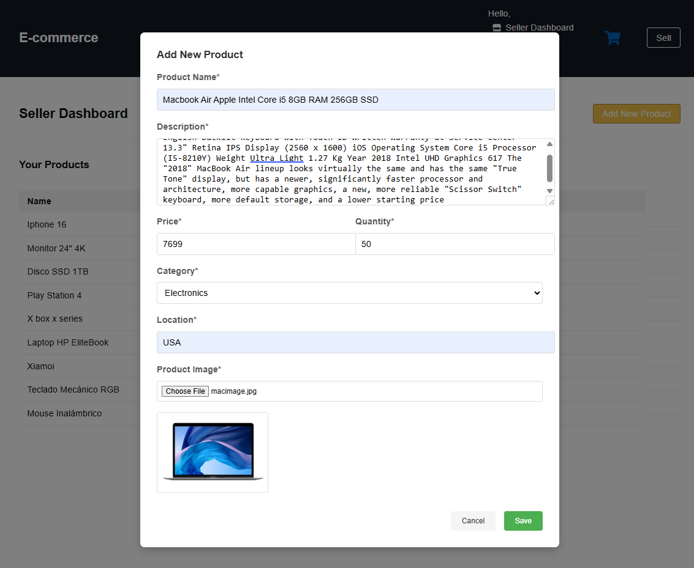
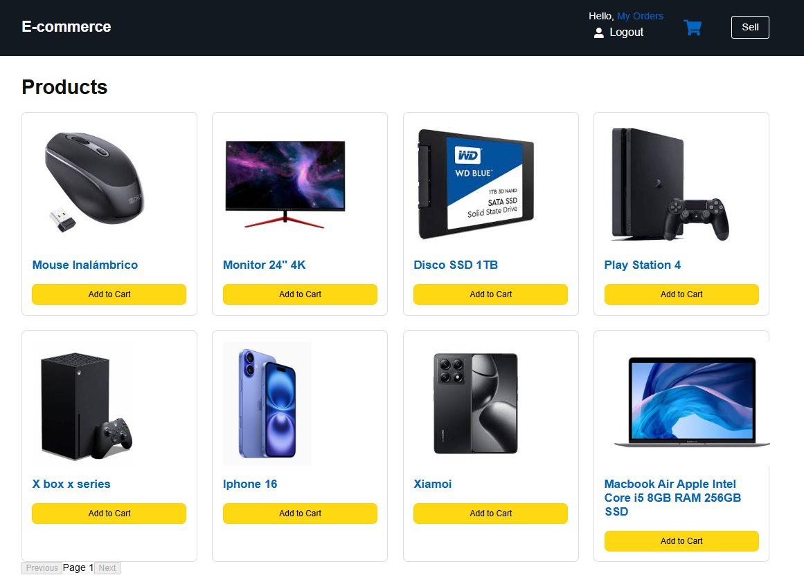
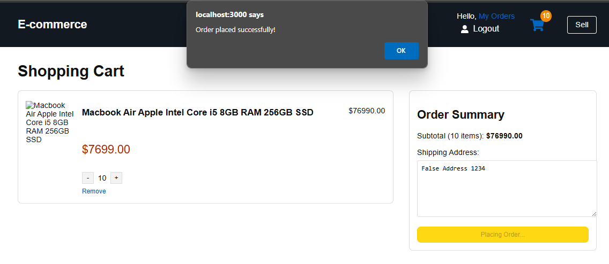
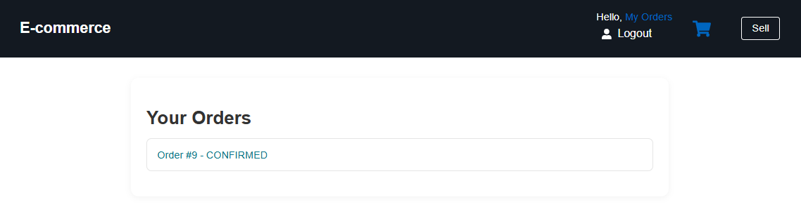
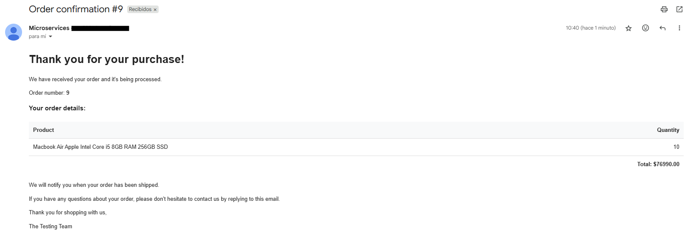
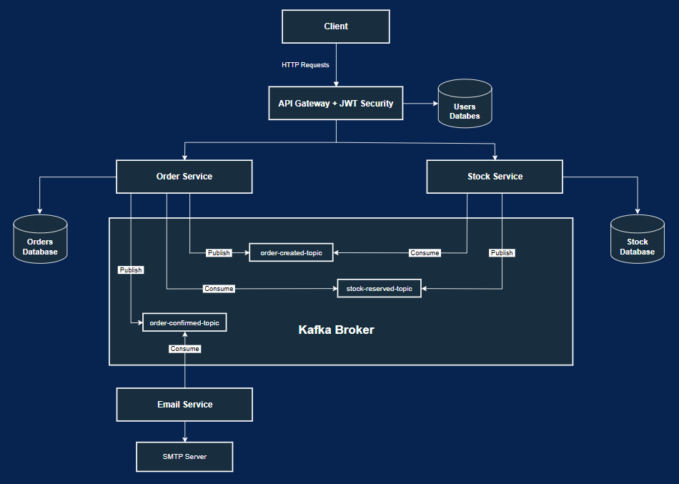
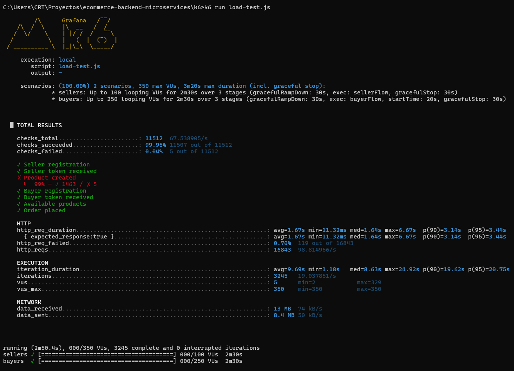
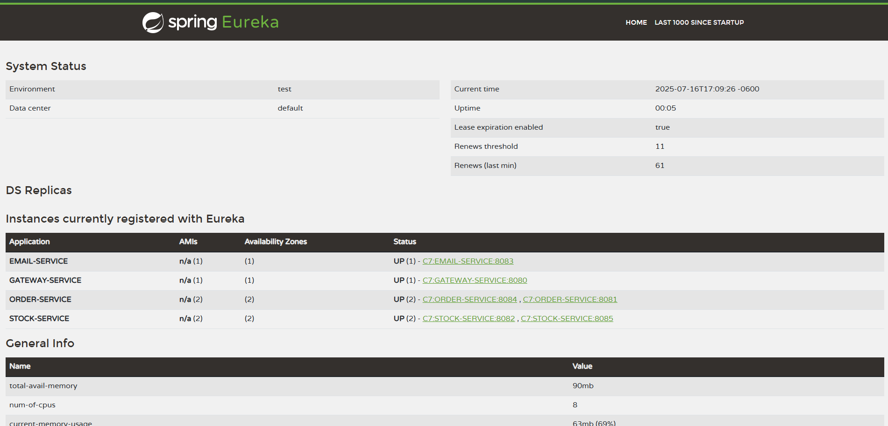

# 🛒 Scalable E-Commerce Backend – Microservices Architecture

Personal proof-of-concept to demonstrate my experience in the backend layer, microservices, authentication, resilience, event-driven communication, and performance under load.

---

## 📌 Description

This application simulates a real-world e-commerce platform using microservices and an event-driven architecture, in which there can be sellers, who publish products for sale, and also buyers, who can view the products that are for sale, place orders, see the status of their orders, and if they are confirmed, receive a notification to their email (you need to be logged in to place orders and have a seller account to publish products).

### 🧾 Key Features

- **Product publishing by sellers (Seller dashboard)**

  

- **Paginated product listing**

  

- **Detailed product view**

  

- **Order creation by buyers**

  

- **Order history (Buyer dashboard)**

  

- **Order detail view**

  

- **Email notifications**

  

- **Stock validation before order confirmation**

  The application validates availability before confirming orders. If sufficient stock is available, the order is marked as `CONFIRMED`; otherwise, it is `REJECTED`.

- **Centralized authentication with Spring Security + JWT**

  All authentication is managed through the API Gateway. Tokens include the user's UUID, email and role.

- **Role-based access control (SELLER, BUYER)**

  Sellers can create products. Buyers can view products, place and view their orders.

- **Load tested under concurrent traffic using K6**

  Simulations executed with up to **3,000 users** and handled over **16,000 HTTP requests** in under 3 minutes.
  The infrastructure demonstrated strong horizontal scalability and resilience under concurrent workloads.

  Performance evaluations were executed in two scenarios:

- **Scenario 1**: Single instance of each microservice (`gateway`, `order-service`, `stock-service`, `product-service`, `email-service`.).
- **Scenario 2**: Two instances of `order-service` and `stock-service`, load balanced via service discovery.

## 🧱 Architecture Overview



## 🛠️ Tech Stack

- Java 17, Spring Boot
- Spring Security (JWT)
- Spring Cloud Gateway
- Spring Cloud Netflix Eureka
- Spring Cloud LoadBalancer
- Spring Data JPA (Order)
- Spring WebFlux + R2DBC (Stock)
- PostgreSQL
- Apache Kafka (event-driven messaging)
- Docker + Docker Compose
- K6 (load testing)

## 🔐 Roles & Permissions

| Role   | Permissions                    |
| ------ | ------------------------------ |
| BUYER  | Browse products, create orders |
| SELLER | Publish products               |

## 📚 API Endpoints

> All endpoints are exposed through the API Gateway (`http://localhost:8080`).  
> Endpoints that require authentication expect a valid JWT in the `Authorization` header.

### 🔐 Auth (via Gateway)

- `POST /auth/register`  
   Register new user.

  📦 Body:
  {
  name: String,
  email: String,
  password: String,
  role: "SELLER" | "BUYER"
  }

- `POST /auth/login`  
   Authenticates and returns a JWT token.

  📦 Body:
  {
  email: String,
  password: String
  }

---

### 🧾 Order Service (via Gateway)

- `POST /api/orderService/placeOrder`  
   Create an order (BUYER role required).  
  📎 Requires JWT  
  📦 Body:
  {
  items: [
  { productCode: String, productName: String, qty: Integer }
  ],
  total: BigDecimal,
  shippingAddress: String
  }

- `GET /api/orderService/orders/`  
  Get all orders for the authenticated user  
  📎 Requires JWT  
  🔐 Extracts user ID from token

- `GET /orderService/{orderId}`  
  Get a specific order for the authenticated user  
  📎 Requires JWT
  📦 Body:
  {
  orderId: Long
  }

---

### 📦 Stock Service (via Gateway)

- `GET /stockService/?page={page}&size={size}`  
  Get paginated list of products  
  📄 Public endpoint (no auth)  
  🔢 Example: `?page=0&size=10`

- `GET /api/stockService/{productCode}`  
  Get detailed information for a specific product  
  📄 Public endpoint
  📦 Body:
  {
  productCode: String
  }

- `GET /api/stockService/image/{productCode}`  
  Retrieve image for a product  
  📄 Public endpoint
  📦 Body:
  {
  productCode: String
  }

- `GET /api/stockService/seller`  
  Get products created by the authenticated seller  
  📎 Requires JWT (SELLER role)

- `POST /api/stockService/seller/create`  
  Create a new product  
  📎 Requires JWT (SELLER role)  
  📦 Body:
  {
  productName: String,
  description: String,
  price: Double,
  qty: Integer,
  category: String,
  minimumStock: Integer,
  location: String,
  image: File
  }

## 📦 Shared Event Module – base_domains

A shared module containing immutable record classes used across all services for Kafka event payloads. This ensures schema consistency and avoids duplication.

## 📊 Load Testing Results – K6

To validate performance and scalability, two stress tests were conducted, simulating the real-world behavior of BUYERS and SELLERS using [K6](https://k6.io/).

All traffic was routed through the API Gateway, triggering workflows for:

- User registration.
- Authentication.
- Product creation.
- Paginated product retrieval (for site display).
- Specific product lookup by ID (to view details).
- Order placement.
- User-specific order history retrieval.
- Retrieving specific orders by their ID to view their information.
- Specific order lookup by ID (to review information)

All at the same time to simulate real-life scenarios.

---

### 🧩 Test Scenarios

| Feature             | Test 1        | Test 2                       |
| ------------------- | ------------- | ---------------------------- |
| Service instances   | 1 per service | 2x order & 2x stock          |
| Service discovery   | ❌ None       | ✅ Eureka Server             |
| Load balancing      | ❌ None       | ✅ Spring Cloud LoadBalancer |
| Virtual users (max) | 350           | 350                          |
| Duration            | 2m51s         | 2m51s                        |

---

### 📌 Functional Results

| Metric                 | Test 1 | Test 2 | ✅ Outcome                 |
| ---------------------- | ------ | ------ | -------------------------- |
| Total users registered | 3245   | 3152   | Similar throughput         |
| SELLERS                | 1468   | 1421   | ✅                         |
| BUYERS                 | 1777   | 1731   | ✅                         |
| Products created       | 1463   | 1417   | ✅                         |
| Orders placed          | 1777   | 1731   | ✅                         |
| Confirmed              | 1594   | 1567   | ✅                         |
| Rejected (no stock)    | 183    | 164    | ✅ (proportional behavior) |
| Internal server errors | 0      | 0      | ✅ No backend failures     |

---

### ⚙️ Performance Metrics

| Indicator               | Test 1 | Test 2 | ✅ Notes                            |
| ----------------------- | ------ | ------ | ----------------------------------- |
| http_req_duration (avg) | 1.67s  | 1.74s  | Slight latency increase             |
| http_req_duration (p95) | 3.44s  | 5.05s  | Higher peak under distributed setup |
| http_req_failed (%)     | 0.70%  | 0.02%  | Significant error reduction         |
| checks_failed           | 5      | 4      | Very reliable execution             |
| Completed iterations    | 3245   | 3152   | Similar scale handled               |
| Total HTTP requests     | 16,843 | 16,380 | Consistent throughput               |
| Data_received           | 13 MB  | 12 MB  | Comparable                          |
| Data_sent               | 8.4 MB | 8.2 MB | Comparable                          |

---

### ✅ Technical Conclusion

- System handled ~3,100 users and ~16,000 HTTP requests without critical failures.
- All flows completed successfully: user auth, product creation, ordering, and querying.
- Scaling order and stock services reduced error rates significantly.
- Eureka & Spring Cloud LoadBalancer successfully distributed traffic among instances.
- Although 95th percentile latency increased slightly, the system gained resilience and consistency under load.

> ⚠️ IMPORTANT NOTE

I performed these tests in my own local environment, which is obviously limited—lacking cloud infrastructure or external load balancers.
Despite this, the system was able to handle over 3,000 users and more than 16,000 HTTP requests, validating its horizontal scalability and resilience even under non-optimal conditions.

---

### 📷 Screenshots (K6 Output)

_Test 1: One instance per service_


_Test 2: With Eureka + load balancing and multiple instances of order service and stock service_




---

## 🚀 Run & Test the System Locally

### 🧰 Requirements

To run this project and simulate production-like behavior:

- Docker & Docker Compose
- Java 17 (optional, only if building manually)
- [K6](https://github.com/grafana/k6/releases) (for running load tests)

---

### ▶️ Start All Services

From the root of the project (`ecommerce-backend-microservices`), run:

```bash
docker compose up --build
```

This will:

- Build and launch all microservices
- Start individual PostgreSQL databases for each service
- Run Kafka and Zookeeper for event-driven messaging
- Register services in Eureka (http://localhost:8761)
- Expose all endpoints behind the API Gateway (http://localhost:8080)

You can confirm everything is running by visiting [Eureka Dashboard](http://localhost:8761/)

### 🧪 Load Testing with K6

To test system scalability, full K6 script is provided in the /k6 directory.

### How to Run the Test

Once services are up:

```bash
cd k6
k6 run load-test.js
```

This simulates:

Registration of users (BUYER and SELLER)

JWT-based authentication

Product creation

Paginated product listings

Product detail views

Order placement

Buyer order history & detail views

⚠️ Make sure all services are running and registered in Eureka before executing the test.

### 📧 Email Service – Notes

The Email Service listens to Kafka order events and prepares email notifications upon successful order confirmation.

What works:

- Consumes Kafka events
- Loads the correct HTML email template
- Logs target email address, subject, and simulated message content
- Sending Real Emails (Optional)
- Real email delivery is currently disabled for security.

To enable it:

- Open email-service/src/main/java/.../EmailService.java
- Look for the commented-out email sender logic

Provide your own:

- Sender email address in application.properties
- App password (for Gmail or another SMTP provider) in application.properties